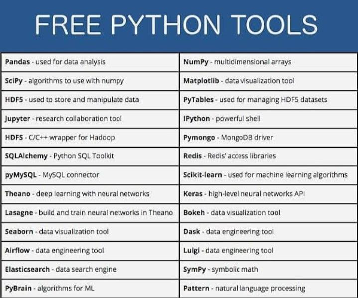

# 🐍 Python

## 🚀 Türkçe Kaynaklar





## 🧰 Başlangıç Kiti



## 👓 Awesome Python

Python ile ilgili her şey



## 🌟 Ayrıntılı Yabacı Kaynak





## 🤹 Eğlenceli Kaynaklar



## 😱 Bilinmeyen Bilgiler



## 🧮 Algoritma Örnekleri



## 🧰 Python Araçları

